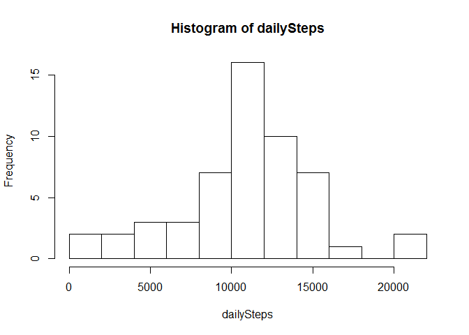

# Reproducible Research: Peer Assessment 1
created by: Peter Sedivec
date: Dec 03, 2012

## Load library dependencies for analysis

```r
# install.packages(c("plyr","lubridate","ggplot2")) - uncomment if packages are not installed
setwd("~/GitHub/RepData_PeerAssessment1")
library(plyr)
library(ggplot2)
library(lubridate)
```

```
## 
## Attaching package: 'lubridate'
## 
## The following object is masked from 'package:plyr':
## 
##     here
```

## Loading and preprocessing the data
Simply use read.csv to load the file and the use mutate and lubridate to convert
the date and interval variables into a R POSIXct time object

```r
act <- read.csv("activity.csv")
act <- mutate(act, dts = ymd_hm(paste0(act$date," ",floor(act$interval / 100), ":",act$interval %% 100)))
str(act)
```

```
## 'data.frame':	17568 obs. of  4 variables:
##  $ steps   : int  NA NA NA NA NA NA NA NA NA NA ...
##  $ date    : Factor w/ 61 levels "2012-10-01","2012-10-02",..: 1 1 1 1 1 1 1 1 1 1 ...
##  $ interval: int  0 5 10 15 20 25 30 35 40 45 ...
##  $ dts     : POSIXct, format: "2012-10-01 00:00:00" "2012-10-01 00:05:00" ...
```

## What is mean total number of steps taken per day?
My interpretation of calculating the mean and median total number of steps per day was to look at the overall time perdiod and determine the mean and median values of steps per day. It doesn't make sense to compute the daily mean/median since we are not interested in mean/median of the steps per interval but instead the entire day. I included the standard deviation calculation since that helps explain the difference of imputing missing values and the impact


```r
dailySteps <- tapply(act$steps, act$date, sum)
meanDailySteps <- mean(dailySteps, na.rm = T)
sdDailySteps <- sd(dailySteps, na.rm = T)
medDailySteps <- median(dailySteps, na.rm = T)
hist(dailySteps, breaks=15)
```

 

The mean total number of steps taken per day is 1.0766189\times 10^{4}, median number of daily steps is 10765 and the standard deviation per day is 4269.1804927

## What is the average daily activity pattern?
First, we'll use ddply to summarize mean steps across each interval and store the result in a dataframe called 'day'. Next I added two fields to the data frame using mutate to capture the time in lubridate format and also in a numeric format. The later was used because I was unable to plot lubridate 'Period' class with either ggplot or base plotting system

```r
day <- ddply(act, .(interval), summarize, mean = mean(steps, na.rm = T))
day <- mutate(day, ldTime = hm(paste0(floor(day$interval / 100), ":",day$interval %% 100)))
day <- mutate(day, time = paste0(floor(day$interval / 100)+day$interval %% 100/60))
str(day)
```

```
## 'data.frame':	288 obs. of  4 variables:
##  $ interval: int  0 5 10 15 20 25 30 35 40 45 ...
##  $ mean    : num  1.717 0.3396 0.1321 0.1509 0.0755 ...
##  $ ldTime  :Formal class 'Period' [package "lubridate"] with 6 slots
##   .. ..@ .Data : num  0 0 0 0 0 0 0 0 0 0 ...
##   .. ..@ year  : num  0 0 0 0 0 0 0 0 0 0 ...
##   .. ..@ month : num  0 0 0 0 0 0 0 0 0 0 ...
##   .. ..@ day   : num  0 0 0 0 0 0 0 0 0 0 ...
##   .. ..@ hour  : num  0 0 0 0 0 0 0 0 0 0 ...
##   .. ..@ minute: num  0 5 10 15 20 25 30 35 40 45 ...
##  $ time    : chr  "0" "0.0833333333333333" "0.166666666666667" "0.25" ...
```

```r
plot(day$time, day$mean,type="l",xlab="Time of Day", ylab="Ave Steps", 
    main=paste("Average steps per 5-min interval between", 
    format(min(act$dts), "%b-%d-%y"), "and", format(max(act$dts), "%b-%d-%y")))
```

 

```r
maxInt <- which.max(day$mean)
maxStepPeriod <- paste(day$ldTime[maxInt],"and",day$ldTime[maxInt+1])
```

The maximum steps per 5 min interval occured between 8H 35M 0S and 8H 40M 0S

## Imputing missing values
My strategy for imputting the missing values is to merge the original dataset with the 'days' dataframe that contains the average per 5-min interval and then use the average per 5 min interval to fill in missing values. It seems to make more sense to base the replacement value on the average for that time interval as opposed to other strategies (e.g. daily average)


```r
ACT <-merge(act, day)
ACT$steps[is.na(ACT$steps)] <- ACT$mean[is.na(ACT$steps)]
ACT <- subset(ACT, select=c("steps","date","interval","dts"))
sum(is.na(ACT)) # verify we've replaced all NAs
```

```
## [1] 0
```

```r
dailyStps <- tapply(ACT$steps, ACT$date, sum)
meanDailyStps <- mean(dailyStps)
sdDailyStps <- sd(dailyStps)
medDailyStps <- median(dailyStps)
hist(dailyStps,breaks=15)
```

 

The mean total number of steps taken per day with NAs replaced is 1.0766189\times 10^{4} (compared with 1.0766189\times 10^{4}), median number of daily steps is 1.0766189\times 10^{4} (compared with 10765), and the standard deviation per day is 3974.390746 (compared with 4269.1804927)

## Are there differences in activity patterns between weekdays and weekends?

The last task was to look at the difference between activity patterns on weekdays vs weekends. To do this I created a factor variable called 'day' and then built a summary table with ddply based on 'interval' and 'day'. I used ggplot to to a two panel layout similar to the example provided in the readme.


```r
ACT$day <- as.factor(ifelse(weekdays(ACT$dts)=="Saturday","weekend",
                  ifelse(weekdays(ACT$dts)=="Sunday", "weekend", "weekday")))
ACTs <- ddply(ACT, .(day, interval), summarize, mean = mean(steps, na.rm = T))
ACTs <- mutate(ACTs, time = paste0(floor(ACTs$interval / 100)+ACTs$interval %% 100/60))

ggplot(aes(x=time, y=mean), data=ACTs)+geom_line(aes(group=day))+facet_wrap(~day,ncol=1)
```

 
